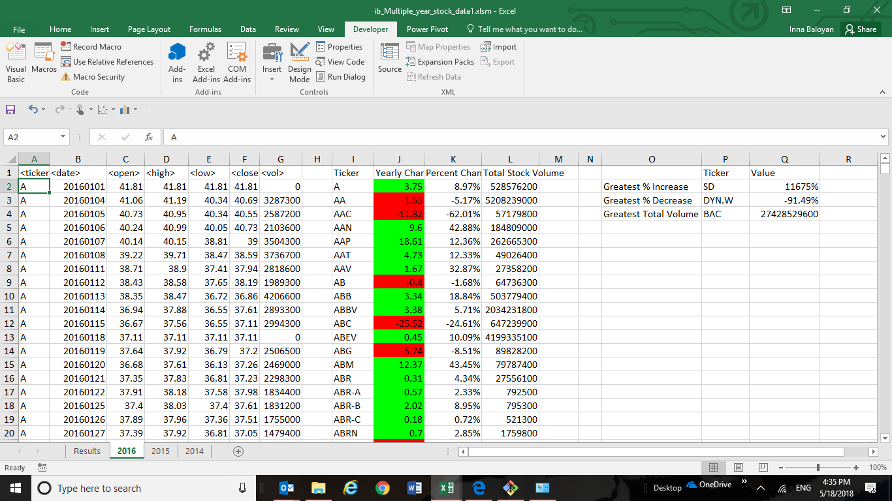

# Stock_Analysis_with_VBA
Create VBA script for Stock Data Analysis, loop through Stock Market Data and return Yearly Stock Performance Results.

### Initial Stock Market Data:

### The Objective of the Project:
The objective of this project is to create a VBA script that provides easy analysis of yearly stock performance. The worksheets are organized by year and contain the starting, final, highest, and lowest value of each stock for each day of the year. The VBA script will give the yearly increase/decrease in stock value for each stock, the percentage change over the year, and the total volume for the year. In addition the stock will give the greatest increase, decrease, and total volume.

The data has been sorted such that the stocks are grouped together by ticker value in alphabetical order
The data is sorted by date such that the dates are in order with the first date for a given stock is the begining of the year and the last value for a give stock is the last date of the year traded.
Non-zero stock value is not assumed. The data in the spreadsheets represents the complete data with no missing values.

* Extract Ticker Symbols:
The unique ticker symbols are extracted and inserted into a column.

* Extract Initial and Final Values for Stock Price:
The initial and final values for the stock price. As non-zero values are not assumed, the first non-zero value is taken to avoid division by zero.

* Calculate Yearly Change, Percentage Change, Total Volume:
The values are calculated for yearly change in stock values, yearly percentage change, and yearly total volume. Values are displayed in spreadsheet next to corresponding ticker value.
Yearly Change = Final Value - Initial (non-zero) Value
Percentage Change = Yearly Change / Initial (non-zero) Value
Total Volume = Sum(Daily Volume)

* Determine Max and Min values:
The "Greatest % Increase", "Greatest % Decrease", and "Greatest Yearly Volume" are determined from the values calculated in the last step and displayed in the chart.

* Provide conditional formatting that will highlight positive change in green and negative change in red.

* VBA script is run once and produces all appropriate adjustments on every worksheet.

### Yearly Stock Performance Results ( 2014-2016 )

### VBA code:

' Hard Solution VB code - Inna Baloyan May2018 Bootcamp
' Going through all worksheets

Sub WorksheetsLoop()

        ' Set CurrentWs as a worksheet object variable.
        Dim CurrentWs As Worksheet
        Dim Need_Summary_Table_Header As Boolean
        Dim COMMAND_SPREADSHEET As Boolean
        
        Need_Summary_Table_Header = False       'Set Header flag
        COMMAND_SPREADSHEET = True              'Hard part flag
        
        ' Loop through all of the worksheets in the active workbook.
        For Each CurrentWs In Worksheets
        
            ' Set initial variable for holding the ticker name
            Dim Ticker_Name As String
            Ticker_Name = " "
            
            ' Set an initial variable for holding the total per ticker name
            Dim Total_Ticker_Volume As Double
            Total_Ticker_Volume = 0
            
            ' Set new variables for Moderate Solution Part
            Dim Open_Price As Double
            Open_Price = 0
            Dim Close_Price As Double
            Close_Price = 0
            Dim Delta_Price As Double
            Delta_Price = 0
            Dim Delta_Percent As Double
            Delta_Percent = 0
            ' Set new variables for Hard Solution Part
            Dim MAX_TICKER_NAME As String
            MAX_TICKER_NAME = " "
            Dim MIN_TICKER_NAME As String
            MIN_TICKER_NAME = " "
            Dim MAX_PERCENT As Double
            MAX_PERCENT = 0
            Dim MIN_PERCENT As Double
            MIN_PERCENT = 0
            Dim MAX_VOLUME_TICKER As String
            MAX_VOLUME_TICKER = " "
            Dim MAX_VOLUME As Double
            MAX_VOLUME = 0
            '----------------------------------------------------------------
             
            ' Keep track of the location for each ticker name
            ' in the summary table for the current worksheet
            Dim Summary_Table_Row As Long
            Summary_Table_Row = 2
            
            ' Set initial row count for the current worksheet
            Dim Lastrow As Long
            Dim i As Long
            
            Lastrow = CurrentWs.Cells(Rows.Count, 1).End(xlUp).Row

            ' For all worksheet except the first one, the Results
            If Need_Summary_Table_Header Then
                ' Set Titles for the Summary Table for current worksheet
                CurrentWs.Range("I1").Value = "Ticker"
                CurrentWs.Range("J1").Value = "Yearly Change"
                CurrentWs.Range("K1").Value = "Percent Change"
                CurrentWs.Range("L1").Value = "Total Stock Volume"
                ' Set Additional Titles for new Summary Table on the right for current worksheet
                CurrentWs.Range("O2").Value = "Greatest % Increase"
                CurrentWs.Range("O3").Value = "Greatest % Decrease"
                CurrentWs.Range("O4").Value = "Greatest Total Volume"
                CurrentWs.Range("P1").Value = "Ticker"
                CurrentWs.Range("Q1").Value = "Value"
            Else
                'This is the first, resulting worksheet, reset flag for the rest of worksheets
                Need_Summary_Table_Header = True
            End If
            
            ' Set initial value of Open Price for the first Ticker of CurrentWs,
            ' The rest ticker's open price will be initialized within the for loop below
            Open_Price = CurrentWs.Cells(2, 3).Value
            
            ' Loop from the beginning of the current worksheet(Row2) till its last row
            For i = 2 To Lastrow
            
          
                ' Check if we are still within the same ticker name,
                ' if not - write results to summary table
                If CurrentWs.Cells(i + 1, 1).Value <> CurrentWs.Cells(i, 1).Value Then
                
                    ' Set the ticker name, we are ready to insert this ticker name data
                    Ticker_Name = CurrentWs.Cells(i, 1).Value
                    
                    ' Calculate Delta_Price and Delta_Percent
                    Close_Price = CurrentWs.Cells(i, 6).Value
                    Delta_Price = Close_Price - Open_Price
                    ' Check Division by 0 condition
                    If Open_Price <> 0 Then
                        Delta_Percent = (Delta_Price / Open_Price) * 100
                    Else
                        ' Unlikely, but it needs to be checked to avoid program crushing
                        MsgBox ("For " & Ticker_Name & ", Row " & CStr(i) & ": Open Price =" & Open_Price & ". Fix <open> field manually and save the spreadsheet.")
                    End If
                    
                    ' Add to the Ticker name total volume
                    Total_Ticker_Volume = Total_Ticker_Volume + CurrentWs.Cells(i, 7).Value
                  
                    
                    ' Print the Ticker Name in the Summary Table, Column I
                    CurrentWs.Range("I" & Summary_Table_Row).Value = Ticker_Name
                    ' Print the Ticker Name in the Summary Table, Column I
                    CurrentWs.Range("J" & Summary_Table_Row).Value = Delta_Price
                    ' Fill "Yearly Change", i.e. Delta_Price with Green and Red colors
                    If (Delta_Price > 0) Then
                        'Fill column with GREEN color - good
                        CurrentWs.Range("J" & Summary_Table_Row).Interior.ColorIndex = 4
                    ElseIf (Delta_Price <= 0) Then
                        'Fill column with RED color - bad
                        CurrentWs.Range("J" & Summary_Table_Row).Interior.ColorIndex = 3
                    End If
                    
                     ' Print the Ticker Name in the Summary Table, Column I
                    CurrentWs.Range("K" & Summary_Table_Row).Value = (CStr(Delta_Percent) & "%")
                    ' Print the Ticker Name in the Summary Table, Column J
                    CurrentWs.Range("L" & Summary_Table_Row).Value = Total_Ticker_Volume
                    
                    ' Add 1 to the summary table row count
                    Summary_Table_Row = Summary_Table_Row + 1
                    ' Reset Delta_rice and Delta_Percent holders, as we will be working with new Ticker
                    Delta_Price = 0
                    ' Hard part,do this in the beginning of the for loop Delta_Percent = 0
                    Close_Price = 0
                    ' Capture next Ticker's Open_Price
                    Open_Price = CurrentWs.Cells(i + 1, 3).Value
                  
                    
                    ' Hard part : Populate new Summary table on the right for the current spreadsheet HERE
                    ' Keep track of all extra hard counters and do calculations within the current spreadsheet
                    If (Delta_Percent > MAX_PERCENT) Then
                        MAX_PERCENT = Delta_Percent
                        MAX_TICKER_NAME = Ticker_Name
                    ElseIf (Delta_Percent < MIN_PERCENT) Then
                        MIN_PERCENT = Delta_Percent
                        MIN_TICKER_NAME = Ticker_Name
                    End If
                           
                    If (Total_Ticker_Volume > MAX_VOLUME) Then
                        MAX_VOLUME = Total_Ticker_Volume
                        MAX_VOLUME_TICKER = Ticker_Name
                    End If
                    
                    ' Hard part adjustments to resetting counters
                    Delta_Percent = 0
                    Total_Ticker_Volume = 0
                    
                
                'Else - If the cell immediately following a row is still the same ticker name,
                'just add to Totl Ticker Volume
                Else
                    ' Encrease the Total Ticker Volume
                    Total_Ticker_Volume = Total_Ticker_Volume + CurrentWs.Cells(i, 7).Value
                End If
                ' For debugging MsgBox (CurrentWs.Rows(i).Cells(2, 1))
          
            Next i

                ' For hard solution part:
                ' Check if it is not the first spreadsheet
                ' Record all new counts to the new summary table on the right of the current spreadsheet
                If Not COMMAND_SPREADSHEET Then
                
                    CurrentWs.Range("Q2").Value = (CStr(MAX_PERCENT) & "%")
                    CurrentWs.Range("Q3").Value = (CStr(MIN_PERCENT) & "%")
                    CurrentWs.Range("P2").Value = MAX_TICKER_NAME
                    CurrentWs.Range("P3").Value = MIN_TICKER_NAME
                    CurrentWs.Range("Q4").Value = MAX_VOLUME
                    CurrentWs.Range("P4").Value = MAX_VOLUME_TICKER
                    
                Else
                    COMMAND_SPREADSHEET = False
                End If
            
         Next CurrentWs
End Sub